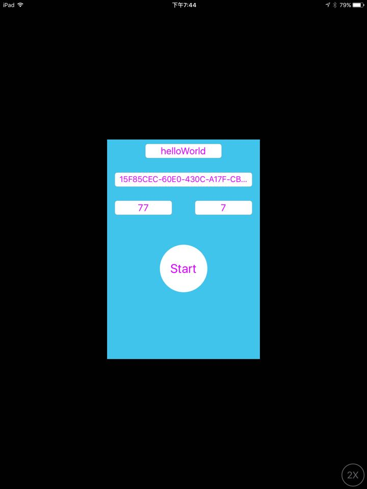
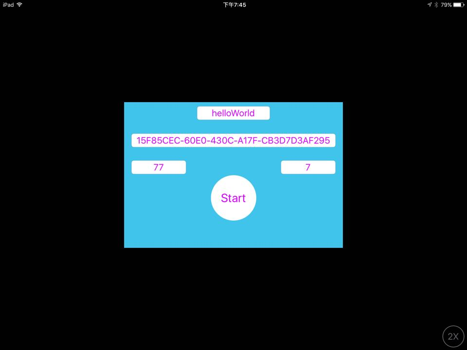
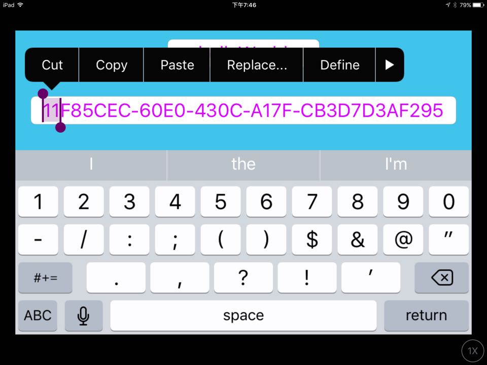
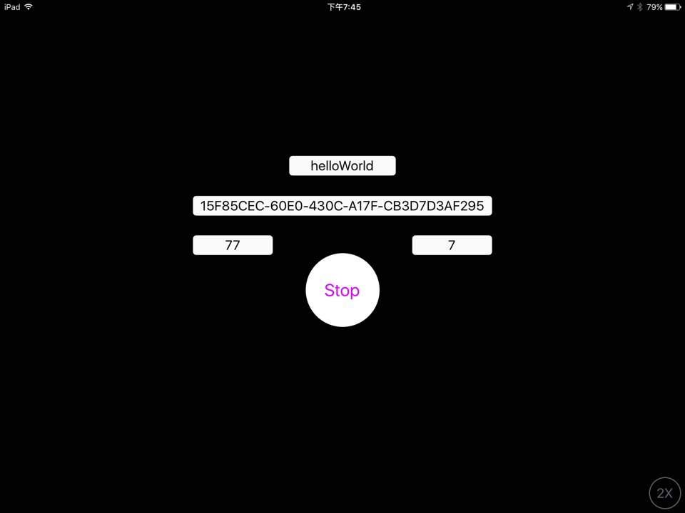
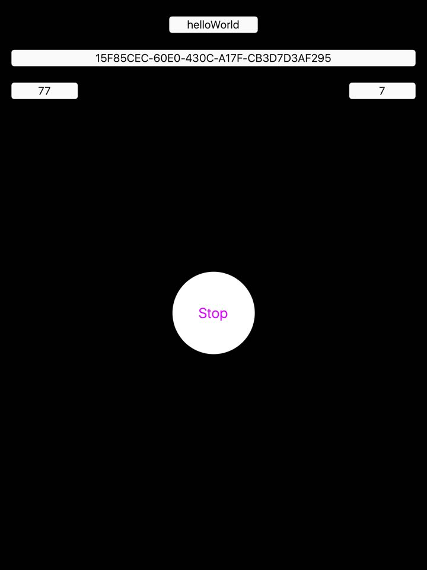

# Simulation iOS Device to iBeacon And Android Phone (Estimote App) Detection iBeacon Signal
## Introduction：
###**[Demonstration Videos](https://youtu.be/feoaque2Mqw)**  (https://youtu.be/feoaque2Mqw)

A simple develop iOS Custom iBeacon and used Estimote App detection iBeacon signal, Use device is iPad(broadcasting iBeacon signals) and Android phone(Estimote App), of course, I use AutoLayout to make various devices version.

- 1.Custom iBeacon "UUID", "Major", "Minor" and "Device Name".

    `// If you set "UUID" = "15F85CEC-60E0-430C-A17F-CB...", "Major" = "77", "Minor" = "7" and "Device Name" = "helloWorld"`

- 2.Broadcasting iBeacon signal.

    `// Start.`
    

- 3.Use Android Phone open Estimote App searching iBeacon, check detected iBeacon information.

    `// Select detection iBeacon.`

- 4.Try modify  iBeacon "UUID", "Major", "Minor" and "Device Name" then Searching detected iBeacon information.

    `// modified and Broadcasting iBeacon signal, check information.`

- 5.Use Bluetooth Device search "Device Name" and understand the differences between the iBeacon Devcie and Bluetooth Device.

    `// Search "Bluetooth Device" get "Device Name" and Search "iBeacon Device" get information.`

##Screen Image：

